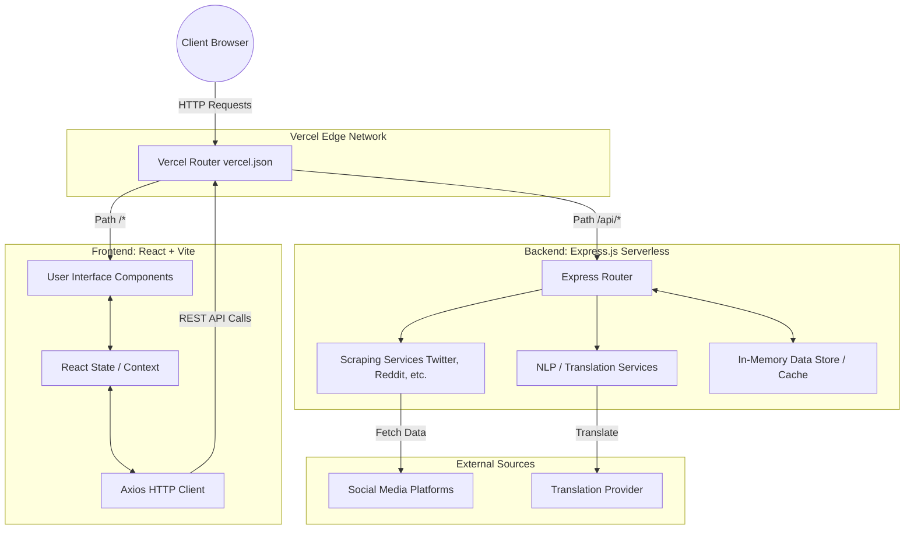

# Passport Social Media Scraper Dashboard

This document provides a concise overview of the architecture, data flow, and setup instructions for the Passport Social Media Scraper Dashboard.

## 1. Architecture Diagram

The project is structured as a monorepo, with a React (Vite) frontend and an Express.js backend, unified for deployment on Vercel.



## 2. API and Data-Flow Explanation

### Data Flow
1. **User Interaction**: The user accesses the dashboard in their browser. The frontend requests the latest aggregated passport-related posts.
2. **Frontend Request**: The React app makes an HTTP GET request to the `/api/posts` endpoint.
3. **Backend Processing**:
   - Vercel routes the `/api/*` request to the Express.js serverless backend.
   - If the data is stale or explicitly requested, the backend triggers the **Scraping Services** to fetch posts from the last 24 hours.
   - The backend runs **NLP Services** on the fetched data to extract sentiment, keywords, and normalize the content.
   - The aggregated and processed data is stored/cached and returned as a JSON response.
4. **Translation**: When a user clicks "Translate", the frontend makes a POST request to `/api/translate` with the text and target language. The backend uses the translation provider to translate the text and returns the result, which updates the UI.

### Key API Endpoints
- `GET /api/posts`: Retrieves all recent aggregated posts. Supports query parameters for filtering (e.g., `?platform=Twitter`, `?sentiment=Positive`).
- `POST /api/posts/scrape`: Manually triggers the scraping process across all configured platforms.
- `POST /api/translate`: Translates a given text snippet.
  - **Body**: `{ "text": "...", "targetLanguage": "es" }`

## 3. Setup Steps

### Prerequisites
- Node.js (v18+)
- npm or yarn

### Local Development Setup

1. **Clone the repository**:
   ```bash
   git clone https://github.com/Sudhanshu77777/Social-Media-Scraper-Dashboard.git
   cd Social-Media-Scraper-Dashboard
   ```

2. **Install Backend Dependencies**:
   ```bash
   cd passport-dashboard-backend
   npm install
   ```

3. **Install Frontend Dependencies**:
   ```bash
   cd ../passport-dashboard-frontend
   npm install
   ```

4. **Environment Variables**:
   Create a `.env` file in the `passport-dashboard-frontend` directory:
   ```env
   VITE_API_BASE_URL=http://localhost:5000/api
   ```
   *(Ensure your backend is configured to run on port 5000 or update accordingly)*

5. **Run Locally (Two Terminal Windows)**:
   - **Terminal 1 (Backend)**:
     ```bash
     cd passport-dashboard-backend
     npm run dev
     ```
   - **Terminal 2 (Frontend)**:
     ```bash
     cd passport-dashboard-frontend
     npm run dev
     ```

### Vercel Deployment Setup

The repository is already configured for monorepo deployment via the root `vercel.json`.

1. Go to [Vercel](https://vercel.com/) and create a new project.
2. Import the `Social-Media-Scraper-Dashboard` repository from GitHub.
3. Keep the **Framework Preset** to `Other` or `Vite`.
4. Leave the Root Directory as `/` (the root of the repo).
5. Add the following **Environment Variables** in the Vercel dashboard:
   - `VITE_API_BASE_URL` : `/api` (This ensures the frontend calls the relative Vercel serverless functions).
6. Click **Deploy**. Vercel will automatically route `/api/*` to your Express backend and serve your Vite frontend at the root.
