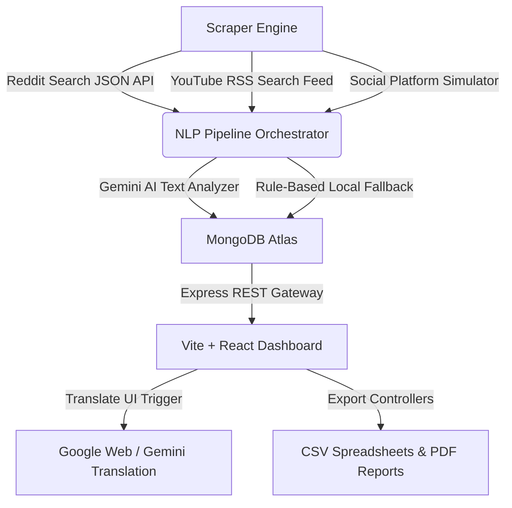

# Social Media Scraper Dashboard (Passport Intelligence Platform)

A full-stack social media analytics dashboard that aggregates, translates, categorizes, and clusters passport-related posts from the last 24 hours across major social media networks (Twitter/X, Facebook, Instagram, LinkedIn, YouTube, Reddit, TikTok).

## 🚀 Live Services Status
* **Dashboard Client**: [http://localhost:5174/](http://localhost:5174/) (Vite + React)
* **API Service Gateway**: [http://localhost:5000/](http://localhost:5000) (Express + MongoDB)
  * Health Endpoint: `/api/health`
  * Statistics Endpoint: `/api/stats`
  * Posts Feed: `/api/posts`

---

## 🏗️ System Architecture & Data Flow



---

## 🌟 Key Features

1. **Real-time Scraping & Platform Simulator**: Pulls real passport posts from Reddit feeds and processes YouTube video metadata. It integrates a high-fidelity platform simulator for Twitter/X, Facebook, Instagram, LinkedIn, and TikTok to seed realistic data.
2. **Translation Service**: Translates posts into 10 target languages (English, Hindi, Punjabi, Spanish, French, German, Arabic, Chinese, Russian, Japanese) on-demand, caching translations in MongoDB to optimize speed and API quota usage. Features a live Google Translate API fallback.
3. **NLP Auto-Categorisation**: Automatically processes posts into topical classifications (Application, Renewal, Appointments, Tatkal, Visa, Travel Issues, Government Announcements, Scams/Fraud, News, Personal Experiences).
4. **Quarantined Spam/Gibberish Filter**: Automatically blocks bot accounts, keyboard-smash inputs, and fake passport advertisements. Quarantined spam is sent to a dedicated **Spam Bin** tab for review.
5. **Clustered Similarity Threads**: Automatically detects and groups matching or duplicate posts under a parent card to avoid dashboard clutter.
6. **Analytics Visualization**: Displays native CSS/SVG graphs for platform distributions, category shares, country metrics, and sentiment index.
7. **CSV & PDF Exporter**: Export the current filtered social stream to clean CSV sheets, or print a print-to-PDF report formatted for paper.

---

## 🛠️ Installation & Setup Guide

### 1. Prerequisites
Ensure you have [NodeJS](https://nodejs.org/) installed.

### 2. Backend Setup
1. Navigate to the backend directory:
   ```bash
   cd passport-dashboard-backend
   ```
2. Install npm dependencies:
   ```bash
   npm install
   ```
3. Set environment configurations in `.env`:
   ```env
   PORT=5000
   MONGO_URI=your_mongodb_connection_string
   GEMINI_API_KEY=your_gemini_api_key
   ```
4. Start the server:
   ```bash
   npm run start
   ```

### 3. Frontend Setup
1. Navigate to the frontend directory:
   ```bash
   cd ../passport-dashboard-frontend
   ```
2. Install npm dependencies:
   ```bash
   npm install
   ```
3. Start the Vite development server:
   ```bash
   npm run dev
   ```
4. Open the browser and visit the port shown in your terminal (usually [http://localhost:5174](http://localhost:5174) or [http://localhost:5173](http://localhost:5173)).

---

## 📑 API Endpoints Documentation
For detailed explanations on REST routes, payload models, and query configurations, please see [api_documentation.md](./api_documentation.md).
